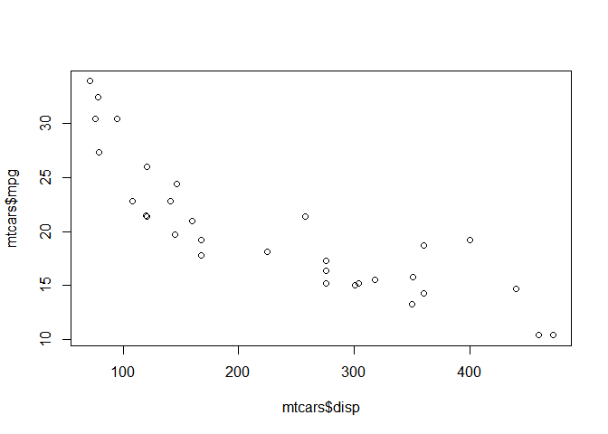

R Markdown
----------

This is an R Markdown document. Markdown is a simple formatting syntax
for authoring HTML, PDF, and MS Word documents. For more details on
using R Markdown see <http://rmarkdown.rstudio.com>.

When you click the **Knit** button a document will be generated that
includes both content as well as the output of any embedded R code
chunks within the document. You can embed an R code chunk like this:

Plot
----

    plot(mtcars$disp, mtcars$mpg)

Regression
----------

    lm(mpg ~ disp, data = mtcars)

    ## 
    ## Call:
    ## lm(formula = mpg ~ disp, data = mtcars)
    ## 
    ## Coefficients:
    ## (Intercept)         disp  
    ##    29.59985     -0.04122
